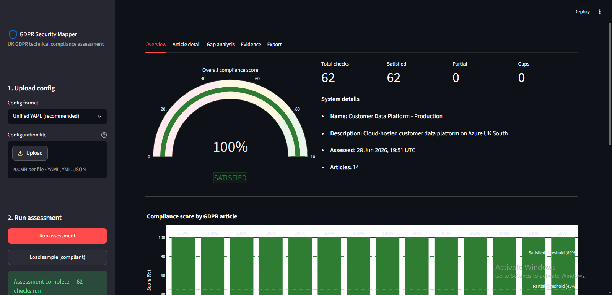

# GDPR Security Mapper

[](https://www.python.org/downloads/)
[](https://opensource.org/licenses/MIT)

Maps a security configuration (YAML or cloud firewall export) to UK GDPR articles. You get a terminal report, JSON, PDF, and a Streamlit dashboard. Each check returns `SATISFIED`, `PARTIAL`, or `GAP` with evidence text and remediation notes.

Assessed against **UK GDPR** (retained EU law). Supervisory authority: **ICO**. See [docs/GDPR_MAPPING_REFERENCE.md](docs/GDPR_MAPPING_REFERENCE.md) for article-to-control mapping.

---

## Background

Security teams maintain technical controls; DPOs need article-level evidence. Legal GRC tools rarely read firewall or encryption settings. Cloud posture scanners find misconfigurations but do not map them to GDPR articles. This tool reads the config you already have and produces structured output per article — 62 checks across 14 articles.

---

## Articles assessed

| Article | Title | Checks | Scope |
|---------|-------|--------|-------|
| Art.5(1)(b) | Purpose Limitation | 3 | Lawful bases, declared purposes, technical enforcement |
| Art.5(1)(e) | Storage Limitation | 3 | Retention policy, per-category periods, automated deletion |
| Art.5(1)(f) | Integrity and Confidentiality | 5 | Encryption, MFA, RBAC, audit logging |
| Art.13 | Transparency — Privacy Notice | 3 | Notice published, current, lawful bases communicated |
| Art.17 | Right to Erasure | 4 | Process documented, SLA ≤30 days, verified deletion |
| Art.25 | Data Protection by Design and Default | 5 | Default deny, least privilege, data minimisation, pseudonymisation |
| Art.30 | Records of Processing Activities | 5 | Authentication logs, data access logs, log retention, processor inventory |
| Art.32(1)(a) | Pseudonymisation and Encryption | 6 | Algorithm strength, TLS version, key rotation |
| Art.32(1)(b) | Confidentiality, Integrity, Availability, Resilience | 6 | Network policy, management port exposure, segmentation, PAM |
| Art.32(1)(c) | Restore Availability After Incident | 5 | Backups enabled, frequency, offsite, tested, encrypted |
| Art.32(1)(d) | Regular Testing and Evaluation | 5 | Vulnerability scanning, patch SLA, penetration testing |
| Art.33 | Notification of Breach to Supervisory Authority | 6 | SIEM, 72h capability, breach register, IR plan, DPO contact |
| Art.35 | Data Protection Impact Assessment | 3 | DPIA completed, DPO sign-off, review schedule |
| Art.44 | General Principle for International Transfers | 3 | Transfer inventory, IDTA/adequacy mechanism, data residency |
| **Total** | | **62 checks** | |

> Assesses **UK GDPR** (retained EU law post-Brexit). The supervisory authority is the **ICO**. Article numbers match EU GDPR. Transfer mechanisms use the ICO's International Data Transfer Agreement (IDTA), not EU SCCs.

---

## Sample output

```
╭─────────────────────────────────────────────────────────────────╮
│              UK GDPR compliance assessment                      │
│                                                                 │
│  Overall Compliance Score: 93.4%  [SATISFIED]                   │
│                                                                 │
│  System:     Customer Data Platform - Production                │
│  Generated:  2026-06-26 16:58 UTC                               │
│  Source:     data/sample_configs/sample_compliant.yaml          │
│  Checks:     60 satisfied  /  2 partial  /  0 gaps              │
│  Confidence: 98% of checks have evidence                        │
╰─────────────────────────────────────────────────────────────────╯

 Article                                   Score    Status     Gaps
 Art.5(1)(b)  Purpose Limitation           100.0%   SATISFIED  0
 Art.5(1)(e)  Storage Limitation           100.0%   SATISFIED  0
 Art.5(1)(f)  Integrity & Confidentiality  100.0%   SATISFIED  0
 Art.13       Transparency                  83.3%   SATISFIED  0
 Art.17       Right to Erasure             100.0%   SATISFIED  0
 Art.25       Data Protection by Design    100.0%   SATISFIED  0
 Art.30       Records of Processing         100.0%   SATISFIED  0
 Art.32(1)(a) Pseudonymisation/Encryption  100.0%   SATISFIED  0
 Art.32(1)(b) CIA Resilience               100.0%   SATISFIED  0
 Art.32(1)(c) Restore Availability         100.0%   SATISFIED  0
 Art.32(1)(d) Regular Testing              100.0%   SATISFIED  0
 Art.33       Breach Notification          100.0%   SATISFIED  0
 Art.35       DPIA                         100.0%   SATISFIED  0
 Art.44       International Transfers      100.0%   SATISFIED  0
```

---

## Quick start

```bash
# Install
pip install -e .

# Generate a blank config template
gdpr-mapper sample --output my_system.yaml

# Edit the template, then scan
gdpr-mapper scan my_system.yaml

# Verbose — show per-check detail in terminal
gdpr-mapper scan my_system.yaml --verbose

# Export PDF report
gdpr-mapper scan my_system.yaml --report pdf --output compliance_report.pdf

# Export JSON (machine-readable)
gdpr-mapper scan my_system.yaml --report json --output report.json

# All three at once
gdpr-mapper scan my_system.yaml --report all --output report

# Launch Streamlit dashboard
gdpr-mapper serve
```

### Azure NSG import

```bash
# Export NSG from Azure CLI
az network nsg show --resource-group rg-prod --name nsg-webapp -o json > nsg.json

# Scan (firewall checks only — other articles need the full unified config)
gdpr-mapper scan nsg.json --format azure-nsg
```

### AWS Security Group import

```bash
# Export from AWS CLI
aws ec2 describe-security-groups --group-ids sg-0abc123 --output json > sg.json

gdpr-mapper scan sg.json --format aws-sg
```

### List all articles and checks

```bash
gdpr-mapper articles
```

---

## Installation

**Requires Python 3.11+**

```bash
# From source
git clone https://github.com/Abosede-o-Makinde/gdpr-security-mapper
cd gdpr-security-mapper
pip install -e .

# Development (includes test and lint tools)
pip install -e ".[dev]"
```

---

## Use cases

- **DPIA baseline** — scan before go-live; Art.35 and Art.32 checks flag gaps in documented measures.
- **Audit evidence** — JSON export includes per-check `evidence` strings you can cite in ICO responses.
- **CI gate** — fail a pipeline when `overall_score` drops below a threshold (see example below).

```bash
gdpr-mapper scan my_system.yaml --report json --output ico_evidence.json
```

```yaml
# CI example — assert minimum score
- run: |
    gdpr-mapper scan infra/security_config.yaml --report json --output /tmp/report.json
    python3 -c "
    import json
    r = json.load(open('/tmp/report.json'))
    assert r['overall_score'] >= 0.80, f\"Score {r['overall_score']*100:.1f}% below 80%\"
    "
```

For periodic monitoring, diff JSON reports month to month. For processor due diligence, ask vendors to complete the YAML template and run the same scan for a comparable profile.

---

## Configuration schema

The unified YAML config covers all 14 article areas. Every field is optional — omitting a field produces a `PARTIAL (not assessed)` finding rather than a gap, so you can start with partial configs and build up coverage.

```yaml
system:
  name: "My System"
  environment: production           # production | staging | development
  data_classification: personal     # personal | sensitive | public
  contains_special_category: false  # true → raises SATISFIED threshold to 90%
  data_subjects_count: 10000
  processing_activities:
    - "User authentication"
    - "Transaction processing"

firewall:
  default_ingress: deny             # deny = privacy-by-default
  network_segmentation: true
  rules:
    - name: "Allow HTTPS"
      protocol: TCP
      port: "443"
      source: "0.0.0.0/0"
      action: allow
      direction: inbound

encryption:
  at_rest:
    enabled: true
    algorithm: "AES-256"
    key_management: hsm             # manual | managed | hsm
  in_transit:
    tls_version: "1.3"
    tls_12_minimum: true
  key_rotation:
    enabled: true
    period_days: 90

access_control:
  mfa:
    enabled: true
    applies_to: all                 # all | privileged | none
  rbac:
    enabled: true
    principle_least_privilege: true

logging:
  audit_logging:
    enabled: true
    covers: [authentication, data_access, admin_actions]
  retention:
    period_days: 365
  siem_integration: true

privacy:
  notice_published: true
  notice_url: "https://example.gov.uk/privacy"
  notice_last_updated: "2026-03-01"
  lawful_bases_documented: true
  purpose_limitation_enforced: true

data_retention:
  policy_documented: true
  maximum_retention_defined: true
  automated_deletion: true
  erasure_requests:
    process_documented: true
    sla_days: 20                    # UK GDPR: must be ≤ 30 days
    verified_deletion: true

# ... incident_response, backups, vulnerability_management,
#     dpia, international_transfers, third_party_processors
# Run: gdpr-mapper sample --output template.yaml  for the full annotated schema
```

---

## Compliance scoring

Each check returns one of:

| Status | Score | Meaning |
|--------|-------|---------|
| `SATISFIED` | 1.0 | Control is in place and evidenced |
| `PARTIAL` | 0.5 | Some evidence but gaps remain, or field not declared |
| `GAP` | 0.0 | Control absent or clear non-compliance |
| `N/A` | 1.0 | Not applicable (e.g. DPIA checks when DPIA is not required) |

**Article score** = weighted average of check scores, where severity determines the weight (CRITICAL=1.5×, HIGH=1.0–1.2×, MEDIUM=0.8–1.0×).

**Overall score** = unweighted average across all 14 articles.

| Overall Score | Status | Meaning |
|--------------|--------|---------|
| ≥ 80% (≥ 90% for special category data) | SATISFIED | Strong control posture |
| 45–79% | PARTIAL | Material gaps requiring attention |
| < 45% | GAP | Significant compliance risk |

### Config confidence score

Every report includes a **confidence score** (0–100%) — the fraction of checks that have real evidence from your config, as opposed to "not assessed" (field not declared). A 40% confidence score means the compliance score is based on limited evidence. Populate more fields to increase confidence and the accuracy of the assessment.

### Art.9 risk uplift

When `system.contains_special_category: true`, the SATISFIED threshold rises from 80% to 90%. Special category data (health, biometric, racial/ethnic origin, political opinions, etc.) under Art.9 carries materially higher risk and the ICO applies stricter scrutiny. The console output displays an `[Art.9 uplift: threshold raised to 90%]` badge when active.

---

## Dashboard

```bash
gdpr-mapper serve           # starts on http://localhost:8501
gdpr-mapper serve --port 8080 --host 0.0.0.0
```



The Streamlit dashboard (`gdpr-mapper serve`) has five tabs: overview (gauge and bar chart), article detail, gap analysis, searchable evidence log, and JSON/PDF export.

---

## Frameworks and standards

| Standard | How it is used |
|----------|----------------|
| **UK GDPR (2018)** | Primary regulatory framework — all checks map to specific articles |
| **ICO guidance** | Threshold values and remediation recommendations reference ICO published guidance |
| **NCSC Cyber Essentials Plus** | Technical controls aligned; patch SLA threshold (14 days) follows CE+ |
| **NCSC CAF** | Cross-referenced in `docs/GDPR_MAPPING_REFERENCE.md` |
| **CIS Controls v8** | Cross-referenced per article (CIS 3, 6, 7, 8, 11, 12, 17, 18) |
| **ISO 27001:2022 Annex A** | Cross-referenced per article (A.5, A.8 controls) |
| **MITRE ATT&CK** | Techniques mitigated per article in `docs/GDPR_MAPPING_REFERENCE.md` |

---

## Development

```bash
pytest                  # full test suite
pytest tests/test_engine.py -v   # engine tests only
ruff check gdpr_mapper/ tests/   # lint
ruff format gdpr_mapper/ tests/  # format
gdpr-mapper scan data/sample_configs/sample_compliant.yaml   # smoke test
```

---

## Project structure

```
gdpr-security-mapper/
├── gdpr_mapper/
│   ├── cli.py              # Click CLI — scan / sample / articles / serve
│   ├── app.py              # Streamlit dashboard
│   ├── models/
│   │   ├── config_input.py # Pydantic v2 input schema (all fields optional)
│   │   └── compliance.py   # CheckResult, ArticleResult, ComplianceReport
│   ├── parsers/
│   │   ├── unified.py      # Native YAML schema parser
│   │   ├── azure_nsg.py    # Azure NSG JSON → SecurityConfig
│   │   └── aws_sg.py       # AWS SG JSON → SecurityConfig
│   ├── engine/
│   │   ├── checks.py       # 62 GDPR compliance check functions + registry
│   │   └── mapper.py       # Orchestrates checks → ComplianceReport
│   └── reporters/
│       ├── console.py      # Rich terminal tables and panels
│       ├── json_rep.py     # JSON serialisation
│       └── pdf_rep.py      # ReportLab multi-page PDF
├── data/sample_configs/    # Demo configs (compliant, partial, gaps, NSG, SG)
├── docs/
│   ├── ARCHITECTURE.md           # Pipeline diagram, scoring formula, extension points
│   ├── GDPR_MAPPING_REFERENCE.md # CIS, ISO 27001, NCSC CAF, MITRE ATT&CK cross-refs
│   └── screenshot.png            # Streamlit dashboard screenshot
├── tests/                  # pytest suite — 48 tests
├── CONTRIBUTING.md         # How to add checks, parsers, and open PRs
├── CODE_OF_CONDUCT.md
├── SECURITY.md
├── CHANGELOG.md
├── pyproject.toml
├── requirements.txt
└── Makefile
```

---

## Limitations

- **Firewall-only parsers** (Azure NSG, AWS SG) can only assess Art.5(1)(f), Art.25 (partial), and Art.32(1)(b). All other articles require the full unified YAML config.
- This tool assesses **declared** configuration, not actual runtime state. A claim that encryption is enabled is taken at face value — independent verification requires infrastructure scanning tools (Prowler, Checkov, etc.).
- Article 30 checks are proxied through logging and processor inventory configuration, which evidences most but not all ROPA requirements. A full ROPA requires a dedicated register.
- This is a decision-support tool. It does not constitute legal advice and is not a substitute for a formal GDPR audit or qualified DPO assessment.

---

## Contributing

See [CONTRIBUTING.md](CONTRIBUTING.md). New checks (with ICO references), parsers, and regression tests are especially useful. [CODE_OF_CONDUCT.md](CODE_OF_CONDUCT.md) applies. Security issues: see [SECURITY.md](SECURITY.md).

---

## Licence

MIT. © 2026 Abosede-o-Makinde
